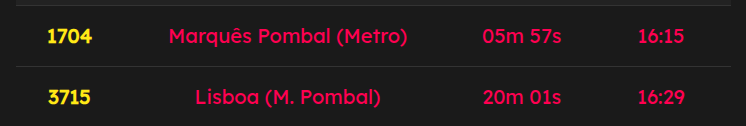
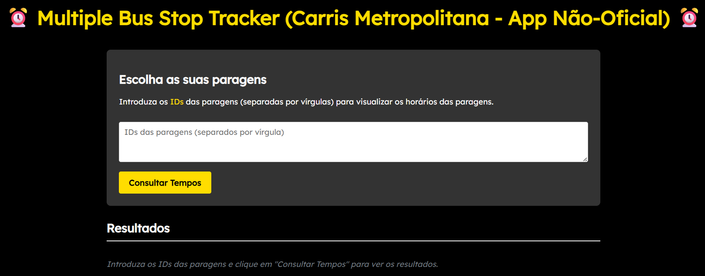
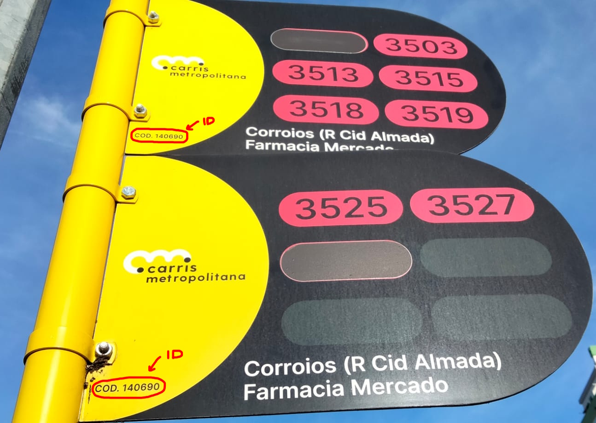
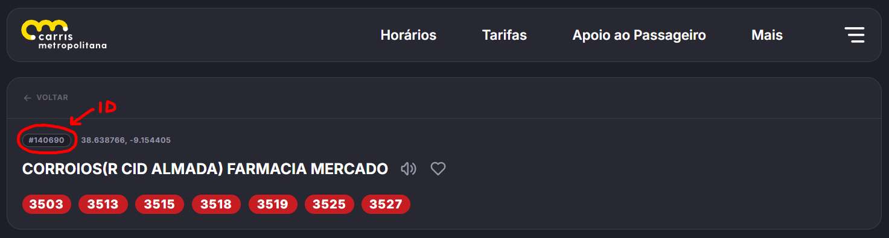
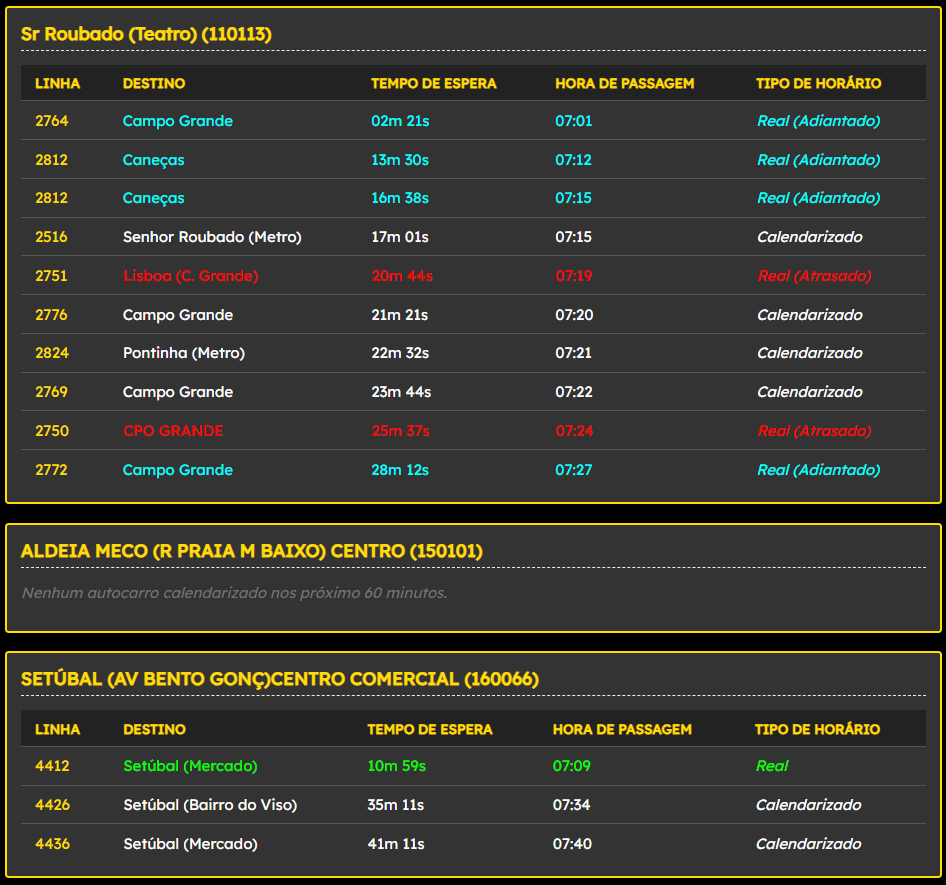
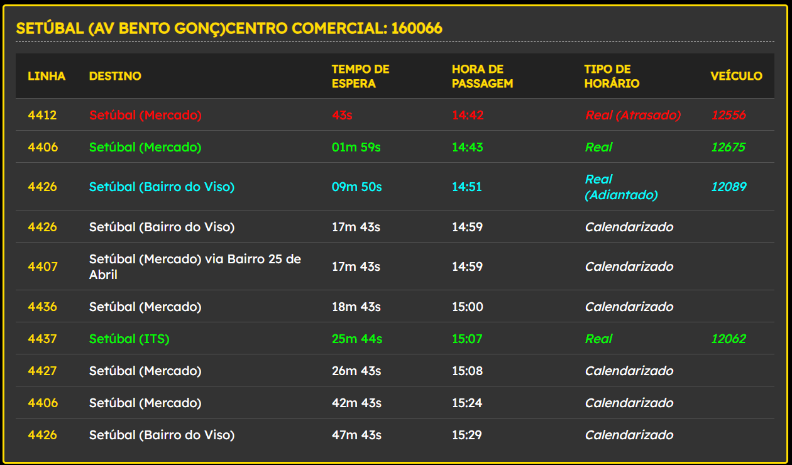
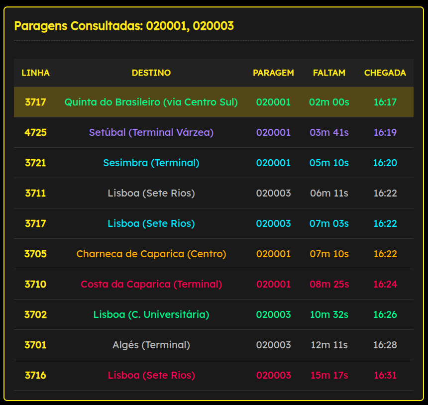
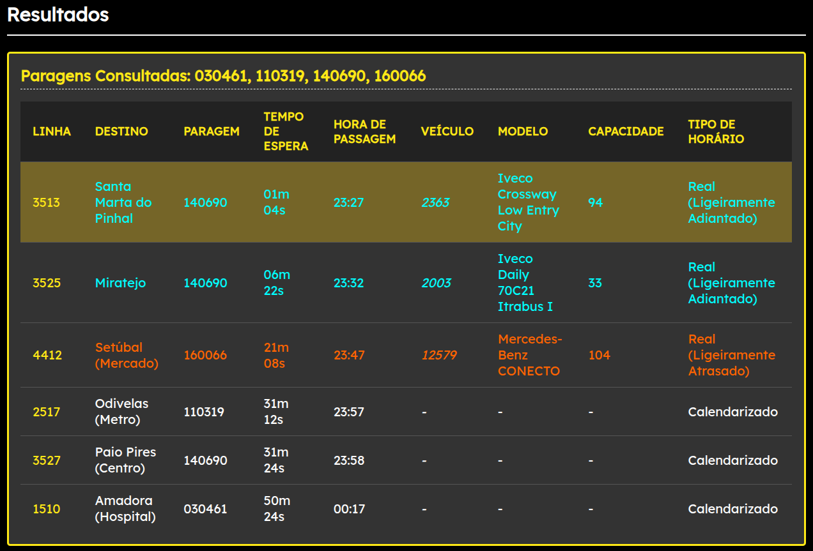

# Multiple Bus Stop Tracker (Carris Metropolitana)

### O que é esta aplicação? (🇵🇹)
Esta aplicação é um rastreador de múltiplas paragens de autocarro (do inglês **Multiple Bus Stop Tracker** (MBST)) para a rede da Carris Metropolitana. Recorrendo à API da Carris Metropolitana, esta aplicação retorna os dados recebidos pela API, que inclui as chegadas dos autocarros, as paragens e os patterns das linhas da Carris Metropolitana, podendo retornar apenas uma ou múltiplas paragens ao mesmo tempo, em poucos cliques.

---

### Porquê? (🇵🇹)
Apesar de a Carris Metropolitana já ter desenvolvido um sistema de paragens inteligente que permite ao utilizador verificar em quanto tempo o autocarro chega (seja em tempo real ou calendarizado), ele ainda assim tem alguns pontos fracos, o maior deles sendo o facto de apenas permitir ao utilizador ver apenas uma paragem de cada vez, o que, para alguns locais, como em terminais rodoviários que tenham várias paragens, se torna pouco prático.

---

### Perguntas (🇵🇹):
**"Por que usar os IDs das paragens para pesquisar as paragens em vez de usar os nomes destas?"**
- **1. Os IDs são valores mais estáveis do que os nomes**

    Um utilizador que está mais atento aos detalhes das paragens à sua volta (seja no terreno, seja no [website](https://carrismetropolitana.pt)) conseguirá perceber que algumas paragens mudaram os seus nomes desde o início da operação da Carris Metropolitana (como [esta](https://carrismetropolitana.pt/stops/020001) (poderá ver isso no tutorial de utilização)). Caso a aplicação utilizasse os nomes para buscar os valores das paragens, algumas destas poderiam não funcionar corretamente, enquanto os IDs são valores mais estáveis para retornar os dados corretamente.

- **2. Praticidade**
    
    Algumas paragens (como [esta](https://carrismetropolitana.pt/stops/020322)) tem nomes mais complexos e pouco amigáveis para os utilizadores, e recorrendo aos nomes das paragens, o utilizador teria de decorar o nome exato da paragem, algo impraticável para paragens com nomes como **LAZARIM (R S MACÁRIO772)QTA S FRANCISCO"** do que apenas o ID da paragem (neste caso, **020322**). Mesmo que os nomes fossem fáceis de memorizar (como acontece nas redes da Carris ou da MobiCascais), ainda assim seria uma melhor solução usar os IDs das paragens do que os nomes pelo ponto abordado anteriormente.

**"Porque os destinos de duas linhas que terminam no mesmo lugar não tem os nomes iguais (exemplo na imagem abaixo)"**

- **Carris Metropolitana**
    
    No caso apresentado, em que as linhas 1704 e 3715 têm nomes diferentes para o mesmo destino (Marquês de Pombal), o resultado apresentado provém diretamente de todos os dados recebidos da API da Carris Metropolitana, não sendo, portanto, da responsabilidade direta do site.

**"Haverá futuras atualizações?"**
- **Possivelmente**
    
    Apesar de a aplicação atual já cumprir com a ideia principal do projeto em si, ela estará disponível para ter futuras atualizações e evoluções, as quais poderão ser sugeridas [aqui](https://github.com/DrMaster7/MBST_CMet/issues). Pull requests são bem-vindas, entretanto, para alterações significativas, abra primeiro uma issue para discutir o que gostaria que fosse alterado e, no caso de fazer uma pull request, certifique-se de atualizar os testes conforme apropriado, garantindo que a aplicação funcione corretamente sem problemas.

---

### Como Instalar? (🇵🇹)
**NOTA IMPORTANTE:** Antes de instalar a aplicação, é importante que o Git e o Node.js estejam instalados no seu dispositivo, garantindo que a aplicação funcione corretamente sem problemas.

1. Abra o seu terminal.

2. Baixe os arquivos: ```git clone https://github.com/DrMaster7/MBST_CMet``` (é aqui que o git será necessário).

3. Entre na pasta da aplicação: ```cd MBST_CMet```.

4. Instale as dependências: ```npm install``` (é aqui que o Node.js será necessário).

5. Inicie o servidor: ```npm start``` (é aqui que o Node.js será necessário).

6. Aceda ao website: ```http://localhost:(PORTA INDICADA NO TERMINAL)```.

Pronto, a aplicação estará pronta a ser usada.

---

### Como Utilizar? (🇵🇹)
**NOTA:** Para exemplificar, as paragens **020001** e **020003** serão usadas como exemplos no decorrer de toda a aplicação.

---

1. Entrando no website, irá deparar-se com este menu:
    
    
    
    **Figura 1:** Menu do website

    No menu irá deparar-se com uma caixa de texto, onde o utilizador irá introduzir os IDs das paragens que desejar. De notar que, quantas mais paragens serem pedidas, mais tempo o pedido poderá retornar resultados. Como já referido, os IDs das paragens serão os valores bases para utilizar no website. Caso o utilizador esteja em dúvida o que seria o ID de uma paragem:
    
    - No terreno, está localizado no canto inferior do semi-círculo amarelo dos postaletes, com uma nomenclatura normalmente de "COD. (ID da paragem)". **Esse é o valor que o utilizador precisa para o website**, como já explicado.
    
        

        **Figura 2:** Postalete em Corroios, com identificação do ID (foto tirada a 22 de Novembro de 2025)

    - No site da Carris Metropolitana, ele é mais fácil de localizar. Bastará ir a https://carrismetropolitana.pt/stops, localizar a sua paragem e verificar a localização do ID (como na figura abaixo), clicando nele que o valor é copiado automaticamente.

        

        **Figura 3:** Página da paragem da Figura 2 no site da Carris Metropolitana.

    Caso o utilizador já tenho feita uma pesquisa anteriormente, os últimos dados serão guardados automaticamente numa cookie que guarda os IDs das paragens, garantindo assim que o utilizador não tenha de voltar a escrever os IDs sempre que tenha de reentrar no website.

---

2. Após pesquisar as paragens, irão aparecer as paragens mais abaixo na página com este formato:

    
    **Figura 4.1:** Exemplo de uma tabela individual

    
    **Figura 4.2:** Exemplo de uma tabela individual com os detalhes adicionais

    As informações na tabela são diretas: Mostra a paragem pesquisada, as linhas que servem essa paragem com os seus destinos, quando tempo faltará até o autocarro chegar na hora de partida prevista e o veículo (identificação, modelo e capacidade) que faz esse horário, ordenados respetivamente. A única exceção é o estado, mas também é simples de entender.

    Como a Carris Metropolitana usa tempo real nos seus autocarros, isso torna mais preciso detectar quando um autocarro chega a uma paragem, permitindo ao utilizador antecipar com antecedência se um autocarro está adiantado, pontual ou atrasado.

    Para facilitar a visualização destes tipos de horários, foram utilizadas seis cores no total (todas para cada tipo de horário):

    - **Ciano:** Horário em tempo real, com o autocarro a circular 1 a 5 minutos antes do horário previsto.

    - **Roxo:** Horário em tempo real, com o autocarro a circular mais de 5 minutos antes do horário previsto.
    
    - **Verde:** Horário em tempo real, com o autocarro a circular dentro do horário previsto.

    - **Laranja:** Horário em tempo real, com o autocarro a circular com 1 a 5 minutos de atraso em relação ao horário previsto.

    - **Vermelho:** Horário em tempo real, com o autocarro a circular com mais de 5 minutos de atraso em relação ao horário previsto.

    - **Cinzento:** Horário programado, sem dados em tempo real disponíveis (normalmente aplicável em paragens terminais ou horários com o tempo real desativado).

    Note que as tabelas mostrarão apenas os próximos 10 horários que estão dentro dos próximos 60 minutos. Se nenhum resultado for encontrado dentro dessas condições, nenhum horário será retornado (por exemplo, se uma pesquisa for feita às 3h da manhã, a maioria das paragens não terá resultados retornados porque a maioria dos autocarros não estaria a circular a essa hora).

    Se um autocarro estiver a 2 minutos da paragem, o registo começará a piscar com uma cor amarela suave, indicando que esse autocarro específico está próximo (seja em tempo real ou não).

    Por último, uma opção importante que resta é o botão «Mostrar/Ocultar detalhes». Ele permite ao utilizador mostrar/ocultar determinados detalhes (como horário, tipo de veículo e sua capacidade).

    No exemplo que vemos acima, a linha 3717 está pontual ao horário calendarizado, a linha 4725 está adiantada ao horário calendarizado, a linha 3721 está ligeiramente adiantada ao horário calendarizado, a linha 3705 está ligeiramente atrasada ao horário calendarizado e as linhas 3703 e 3710 estão atrasadas ao horário calendarizado. As restantes linhas (em cinzento) neste caso ainda não iniciou o serviço (porém, alguns horários calendarizados podem indicar que ou o tempo real está desativado ou com um erro, ou que específica linha começa nessa paragem). De também notar que, mais para baixo, como o autocarro da 3717 está próximo da paragem, o fundo do registo desta está piscando, como esperado.

    De notar que, para otimização dos recursos e dos tempos de espera para as pesquisas, por defeito será criado um ficheiro pattern_cache.json na pasta do projeto que irá guardar todos os valores das paragens pesquisadas nas últimas 24 horas com a sua paragem de destino. Tal irá permitir evitar uma sobrecarga de pedidos da API para valores que o site já recebeu da mesma nas últimas 24 horas, permitindo assim uma maior eficiência nos pedidos ao mesmo tempo que receberá os valores atualizados da API.

---

3. Também irá reparar que após pesquisar as paragens, irá aparecer um botão ao lado com a legenda "Tabela Mestre". É aqui que o website irá permitir que você possa juntar as várias paragens pesquisadas numa única tabela, como mostrado abaixo:

    
    **Figura 5.1:** Exemplo de uma tabela mestre

    
    **Figura 5.2:** Exemplo de uma tabela mestre com detalhes

    O sistema deste tipo de tabela é igual ao das tabelas individuais, excetuando o facto dos nomes das paragens não serem incluídos e a inclusão coluna "paragem", que apenas indica o ID da paragem a que esse horário está associado.

---

### What is this application? (🇬🇧)
This application is a multiple bus stop tracker (MBST) for the Carris Metropolitana network. Using the Carris Metropolitana API, this application returns the data received by the API, which includes bus arrivals, stops, and patterns for Carris Metropolitana lines. It can return just one or multiple stops at the same time, in just a few clicks.

---

### Why? (🇬🇧)
Although Carris Metropolitana has already developed a smart stop system that allows users to check how long it will take for the bus to arrive (either in real time or scheduled), it still has some shortcomings, the biggest of which is that it only allows users to view one stop at a time, which for some locations, such as bus terminals with multiple stops, is impractical.

---

### Questions (🇬🇧):
**“Why use stop IDs to search for stops instead of using their names?”**
- **1. IDs are more stable values than names**

    A user who pays closer attention to the details of the stops around them (whether on the ground or on the [website](https://carrismetropolitana.pt)) will notice that some stops have changed their names since Carris Metropolitana began operating (such as [this one](https://carrismetropolitana.pt/stops/162007)). If the application used names to search for stop values, some of these may not function correctly, whereas IDs are more stable values for returning data correctly.

- **2. Practicality**
    
    Some stops (such as [this one](https://carrismetropolitana.pt/stops/020322)) have more complex names that are not very user-friendly, and when using stop names, the user would have to memorize the exact name of the stop, which is impractical for stops with names such as **LAZARIM (R S MACÁRIO772)QTA S FRANCISCO"** than just the stop ID (in this case, **020322**). Even if the names were easy to remember (as is the case with the Carris or MobiCascais networks), it would still be a better solution to use stop IDs than names for the reason discussed before.

**“Why do two lines that end at the same place not have the same names (example in the image below)?”**

- **Carris Metropolitana**
    
    In the case presented, where lines 1704 and 3715 have different names for the same destination (Marquês de Pombal), the result shown comes directly from all the data received from the Carris Metropolitana API and is therefore not the direct responsibility of the website.

**“Will there be future updates?”**
- **Possibly**
    
    Although the current application already fulfills the main idea of the project itself, it will be available for future updates and developments, which can be suggested [here](https://github.com/DrMaster7/MBST_CMet/issues). Pull requests are welcome, however, for significant changes, first open an issue to discuss what you would like to change, and if you make a pull request, be sure to update the tests as appropriate, ensuring that the application works correctly without problems.

---

### How to Install? (🇬🇧)
**IMPORTANT NOTE:** Before installing the application, it is important that Git and Node.js are installed on your device, ensuring that the application works correctly without problems.

1. Open your terminal.

2. Download the files: ```git clone https://github.com/DrMaster7/MBST_CMet``` (this is where git will be needed).

3. Enter the application folder: ```cd MBST_CMet```

4. Install the dependencies: ```npm install``` (this is where Node.js will be needed)

5. Run the server: ```npm start``` (this is where Node.js will be needed)

6. Access the website: ```http://localhost:(PORT INDICATED IN THE TERMINAL)```

That's it, the application is ready to use.

---

### How to use it? (🇬🇧)
**NOTE:** For illustrative purposes, stops **020001** and **020003** will be used as examples throughout the application.

---

1. When you enter the website, you will see this menu:
    
    
    
    **Figure 1:** Website menu

    In the menu, you will see a text box where you can enter the IDs of the stops you want. Please note that the more stops you request, the longer it will take for the request to return results. As mentioned above, the stop IDs will be the base values to use on the website. If you are unsure what a stop ID is:
    
    - On the ground, it's located at the bottom corner of the yellow semi-circle of the bus stops, usually labelled "COD. (Stop ID)". **This is the value that the user needs for the website**, as already explained.
    
        

        **Figure 2:** Stop in Corroios, with ID identification (photo taken at 22 November 2025)

    - On the Carris Metropolitana website, it is easier to find. Simply go to https://carrismetropolitana.pt/stops, locate your stop and check the location of the ID (as in the figure below), clicking on it to automatically copy the value.

        

        **Figure 3:** Page for the stop in Figure 2 on the Carris Metropolitana website.

    If the user has already performed a search previously, the last data will be automatically stored in a cookie that saves the stop IDs, thus ensuring that the user does not have to re-enter the IDs each time they return to the website.

---

2. After searching for stops, the stops will appear further down the page in this format:

    
    **Figure 4.1:** Example of an individual table

    
    **Figure 4.2:** Example of an individual table with the additional details

    The information in the table is straightforward: it shows the stop searched for, the routes that serve that stop with their destinations, how long it will take for the bus to arrive at the scheduled departure time, and the vehicle (identification, model, and capacity) that runs that route, sorted respectively. The only exception is the type of timetable, but it is also simple to understand.

    Because Carris Metropolitana uses real time on its buses, this makes more accurate to detect when a bus arrives at a stop, allowing the user to anticipate in advance if a bus is early, on time or late.

    To make it easier to view these types of timetables, six colours in total were used (all for each type of timetable):

    - **Cyan:** Real-time timetable, with the bus running 1 to 5 minutes ahead of schedule.

    - **Purple:** Real-time timetable, with the bus running more than 5 minutes ahead of schedule.
    
    - **Green:** Real-time schedule, with the bus running on time relative to the scheduled timetable.

    - **Orange:** Real-time schedule, with the bus running 1 to 5 minutes behind the scheduled timetable.

    - **Red:** Real-time schedule, with the bus running more than 5 minutes behind the scheduled timetable.

    - **Grey:** Scheduled timetable, no real-time data available (usually applicable at terminal stops or schedules with the real time deactivated).

    Please note that the tables will only show the next 10 times that are within the next 60 minutes. If no results are found within these conditions, no times will be returned (for example, if a search is made at 3 a.m., most stops will have no results returned because most buses would not be running at that time).

    If a bus is 2 minutes away from the stop, the record will start flashing a soft yellow colour, indicating that this specific bus is nearby (whether in real time or not).

    Finally, an important option that remains is the ‘Show/Hide details’ button. It allows the user to show/hide certain details (such as timetable, vehicle type and capacity).

    In the example above, line 3717 is running on time, line 4725 is ahead of schedule, line 3721 is slightly ahead of schedule, line 3705 is slightly behind schedule, and lines 3703 and 3710 are behind schedule. The remaining lines (in grey) in this case have not yet started service (however, some scheduled times may indicate that either real time is disabled or there is an error, or that a specific line starts at that stop). Also note that further down, as the 3717 bus is close to the stop, the background of the record is flashing, as expected.

    Note that, in order to optimise resources and search waiting times, a pattern_cache.json file will be created by default in the project folder, which will store all the values of the stops searched in the last 24 hours with their destination stop. This will prevent an overload of API requests for values that the site has already received from it in the last 24 hours, thus allowing for greater efficiency in requests while receiving updated values from the API.


---

3. You will also notice that after searching for stops, a button will appear next to them with the label "Master Table". This is where the website will allow you to combine the various stops searched into a single table, as shown below:

    
    **Figure 5.1:** Example of a master table

    
    **Figure 5.2:** Example of a master table with details

    The system for this type of table is the same as for individual tables, except for the fact that the names of the stops are not included and the inclusion of the ‘stop’ column, which only indicates the ID of the stop to which that timetable is associated.
